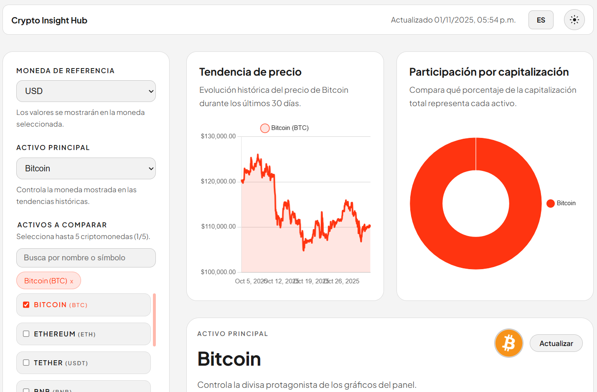
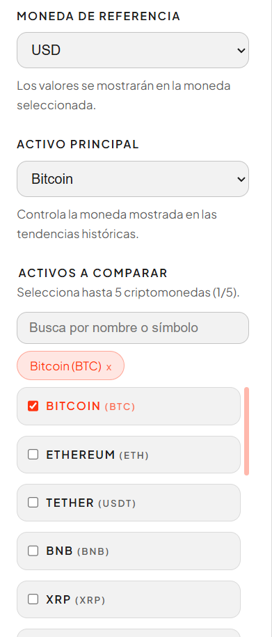

# Dinametra Crypto Dashboard

Dashboard interactivo construido con React, Vite y TypeScript que consume la API pública de CoinGecko para presentar métricas del mercado cripto en tiempo real. Incluye visualizaciones dinámicas, filtros accesibles, diseño responsivo y pruebas automatizadas.

## Capturas

- Estado general: 
- Panel de filtros: 

## Características destacadas

- **Dos visualizaciones complementarias:** línea histórica del precio y gráfico de participación por capitalización, ambos con leyendas y tooltips configurados.
- **Filtros dinámicos:** selección de moneda de referencia, rango temporal y hasta cinco criptomonedas simultáneamente, con accesibilidad por teclado.
- **Datos en vivo desde CoinGecko:** manejo de errores, estados de carga y sincronización manual.
- **Diseño responsivo:** layout basado en CSS Grid/Flexbox optimizado para escritorio, tablet y móvil.
- **Accesibilidad cuidada:** skip link, landmarks, `aria-live` en mensajes dinamicos, foco gestionado y uso de controles nativos.
- **Pruebas automáticas:** Vitest + Testing Library cubriendo lógica de formato y reglas del panel de filtros.

## Stack técnico

- React 19 + TypeScript
- Vite 7
- Chart.js 4 y react-chartjs-2
- CSS modular con utilidades propias
- Vitest, @testing-library/react, happy-dom

## Requisitos previos

- Node.js >= 20.10 (idealmente 20.19 o superior para evitar advertencias de Vite)
- npm >= 10

## Instalación y uso

```bash
# Instalar dependencias
npm install

# Servidor de desarrollo
npm run dev

# Compilación para producción
npm run build

# Vista previa de la build
npm run preview

# Ejecutar pruebas unitarias una sola vez
npm run test -- --run

# Pruebas con cobertura
npm run test:coverage
```

La aplicación puede funcionar con los endpoints públicos de CoinGecko sin configurar claves, pero también soporta configurar una API key y otros parámetros mediante variables de entorno (útil si usas la versión PRO de CoinGecko o un proxy).

Variables de entorno disponibles (opcional)

- `VITE_COINGECKO_API_KEY` — Tu API key de CoinGecko (prefijo `CG-...`). Si está vacía se usará el endpoint público.
- `VITE_COINGECKO_API_ROOT` — Override del root de la API (útil si usas un proxy en desarrollo). Debe apuntar al dominio raíz (sin `/` final).
- `VITE_COINGECKO_USE_PRO_API` — `true`/`false` para indicar que quieres usar el endpoint PRO de CoinGecko.
- `VITE_AUTO_REFRESH_MS` — Intervalo de polling en milisegundos. Poner `0` desactiva el auto-refresh. Recomendado: `30000`–`60000`.

Consejos y comportamiento en desarrollo

- En desarrollo se incluye un proxy de Vite que reexpone CoinGecko en `/api/coingecko` para evitar problemas de CORS. No es necesario configurar nada extra para `npm run dev`.
- Debido a límites de tasa en la API pública, el hook de datos implementa backoff exponencial, jitter y pausa cuando la pestaña del navegador está en segundo plano. Si recibes un 429 (Too Many Requests) la UI mostrará un mensaje con opción a reintentar.
- Nunca subas claves privadas a Git. Usa `.env` local (ver `.env.example`) o las herramientas de secretos de tu proveedor de despliegue.

Si la API responde con limitaciones de rate limit, puedes:

- Aumentar `VITE_AUTO_REFRESH_MS` para reducir la frecuencia de peticiones.
- Usar una API key PRO (si procede) o desplegar un proxy propio que cachee resultados.
- Reintentar la carga desde el botón “Reintentar” del dashboard.

## Estructura relevante

```
src/
  components/       // UI modular (gráficas, tablas, filtros, cabeceras)
  hooks/            // Lógica de obtención y transformación de datos
  services/         // Cliente ligero para la API de CoinGecko
  utils/            // Helpers de formato numérico y utilidades
  setupTests.ts     // Configuración de Testing Library + Vitest
public/screenshots/ // Capturas ilustrativas incluidas en el README
```

## Detalles funcionales

- **Filtros dependientes:** al cambiar la moneda base, las métricas y la serie histórica se recalculan automáticamente y se preservan las selecciones siempre que estén disponibles en el nuevo listado.
- **Verificación de límites:** el panel impide seleccionar más de cinco activos y garantiza que al menos uno permanezca activo para evitar estados inconsistentes.
- **Accesibilidad:** todos los controles son navegables con teclado, se proveen mensajes descriptivos mediante `aria-live`, y se añade un enlace “Saltar al contenido” para lectores de pantalla o navegación sin ratón.
- **Rendimiento:** las llamadas se cancelan mediante `AbortController` cuando los filtros cambian rápidamente, evitando condiciones de carrera y peticiones obsoletas.

## Despliegue sugerido

El bundle está listo para plataformas estáticas (Netlify, Vercel, GitHub Pages). Pasos generales:

1. Ejecuta `npm run build`.
2. Sube el contenido de `dist/` al proveedor elegido o enlaza el repositorio para despliegue automático.
3. Asegúrate de habilitar cabeceras `Cache-Control` adecuadas si publicas recursos en CDN.

>[URL de la demostración en vivo.](https://dashboard-dinametra.netlify.app/)

## Pruebas y cobertura

- `npm run test -- --run` ejecuta los tests en modo puntual.
- `npm run test:coverage` genera un reporte de cobertura usando vitest/coverage-c8.

Las pruebas incluidas validan la formateación numérica y las reglas de selección del panel de filtros. Se recomienda ampliar la suite con escenarios de integración adicionales si el dashboard evoluciona.

## Próximos pasos opcionales

- Agregar persistencia de preferencias del usuario (LocalStorage).
- Incluir exportación de datos a CSV o imágenes de los gráficos.
- Integrar tests de contrato con la API para detectar cambios en los endpoints.

---

**Licencia:** MIT. Puedes adaptar y extender esta solución libremente, manteniendo créditos a la API de CoinGecko conforme a sus términos de uso.
